# 💱 Currency Exchange Rate API (Spring Boot)

A robust, high-performance Spring Boot application that provides currency exchange rates using a layered architecture
with:

- ✅ External API for real-time exchange rates
- 🧠 Redis Cache for fast, short-term storage and minimizing API usage
- 🗃 PostgreSQL Database for persistence and historical lookup
- 📨 RabbitMQ for asynchronous database persistence
- 📘 Swagger UI for API documentation and testing
- 🐳 Docker Compose for seamless local development

---

## 🧩 Features

- **Get exchange rate** between two currencies.
- **Smart caching** with Redis to avoid redundant API calls.
- **Asynchronous writes** to the database via RabbitMQ for improved performance.
- **API-first design** with Swagger documentation.
- **Secure endpoints** using JWT.
- **Dockerized setup** for Postgres, Redis, RabbitMQ, and the Spring Boot app.

---

## 🏗 Architecture Overview

```mermaid
graph TD
    A["Client Request (base=USD, target=EUR)"] --> B["ExchangeRateController"]
    B --> C{"Redis Cache (USD→EUR)"}
    C -- Hit --> R1["Return Cached Rate (USD→EUR)"]
    C -- Miss --> D{"Postgres DB (USD→EUR)"}
    D -- Found --> R2["Return DB Rate (USD→EUR)"]
    D -- Not Found --> E["External Exchange API Call (USD→All)"]
    E --> F["ExchangeRate Map (USD → {EUR, GBP, JPY...})"]
    F --> G["Cache All Exchange Rates in Redis"]
    G --> H["Return Requested Pair (USD→EUR) to User"]
    G --> I["Send Full Map to RabbitMQ"]
    I --> J["ExchangeRateListener"]
    J --> K["Persist All Exchange Rates to PostgreSQL"]
```



---

## 🚀 Getting Started

### 🔧 Prerequisites

- Docker & Docker Compose
- Java 21
- Maven
- Free key from https://exchangerate.host/

---

### 📦 Run the App (with Docker Compose)

Clone the project:

```bash
git clone https://github.com/nikossyr/CurrencyXRatesRedisRabbitMQ.git
cd CurrencyXRatesRedisRabbitMQ
```

Create a `.env` file based on `.env.example` provided. Add the key provided from https://exchangerate.host/
and generate a strong 512bit base64 key for HS512 encryption for JWT using the following command:

```bash
openssl rand -base64 64
```

Run all required services:

```bash
docker-compose up --build
```

This will start:

- Spring Boot App on `localhost:8080`
- Redis on `localhost:6379`
- PostgreSQL on `localhost:5432`
- RabbitMQ on:
    - AMQP: `localhost:5672`
    - Management UI: `http://localhost:15672` (default user/pass: `guest`/`guest`)

---

### 🔍 API Documentation

Access Swagger UI at:

```bash
http://localhost:8080/swagger-ui/index.html
```

Signup with a new user using:

- `POST /api/auth/signup`

Login with the user created:

- `POST /api/auth/login`

Copy the JWT provided and add it to the `Authorize` button of the Swagger UI.

Now you can test the endpoint of the app:

- `GET /api/exchange?base=USD&target=EUR`

---

## 🧰 Tech Stack

| Component        | Technology                  |
|------------------|-----------------------------|
| Backend          | Spring Boot (Java 21)       |
| Cache            | Redis                       |
| Persistence      | PostgreSQL                  |
| Messaging        | RabbitMQ                    |
| API Doc          | Springdoc OpenAPI / Swagger |
| Containerization | Docker, Docker Compose      |
| Build Tool       | Maven                       |

---

## ✅ Capabilities Recap

- 🔁 **Redis**: Reduces redundant external API calls using TTL-based cache.
- 💾 **PostgreSQL**: Stores historical and persistent data.
- ⚡ **RabbitMQ**: Asynchronous message queue used to save data to DB in the background.
- 🧪 **Unit Tested**: Service layer tested with mocks for Redis, DB, and external API.
- 🔐 **JWT Ready**: Token-based authentication support included
- 🐳 **One-Command Setup**: Fully containerized development environment.